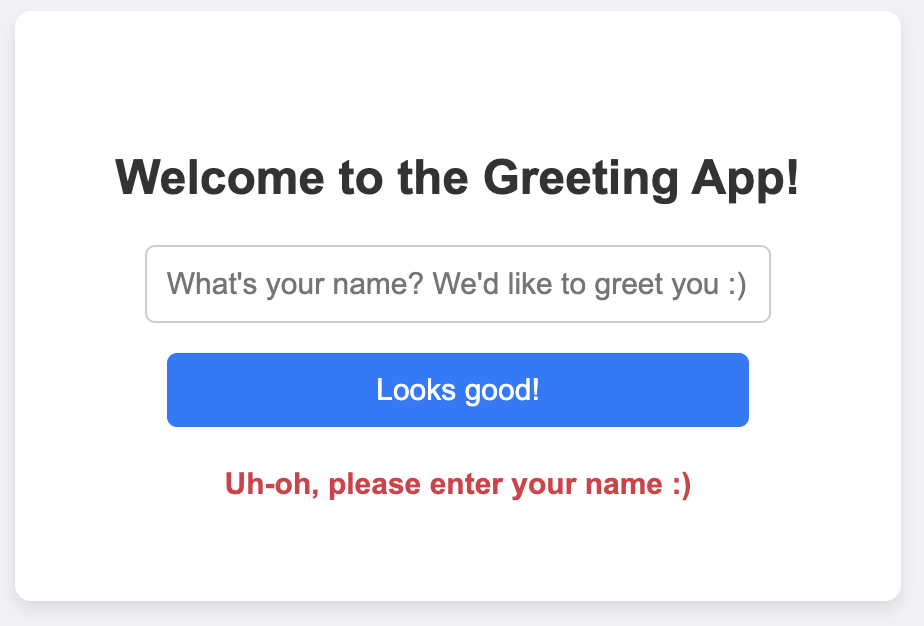
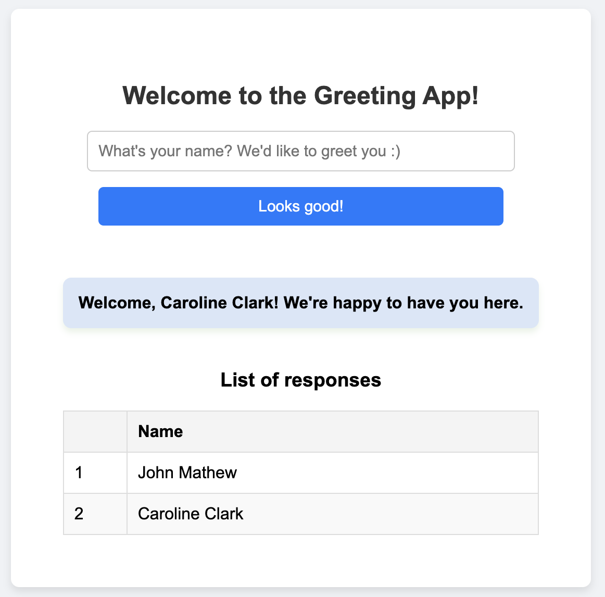

# AXA XL Coding Challenge

## Overview

The goal of this challenge is to create a React and TypeScript-based application where:

- The user can input their name.
- The app will respond with a personalized greeting.
- It involves making an asynchronous API call (test, in this case) to simulate backend communication.
- Includes proper error handling and loading states.
- Features a responsive design that works across devices.

## Process

1. **Setting Up the Project:**
   - I began by setting up a **React** project with TypeScript.
   - I initialized a local Git repository to track the project progress and used **GitHub** for version control.

2. **User Input Form:**
   - I created an input form where users can type their name. Upon submission, the app displays a personalized greeting message.
   - I implemented input validation to ensure that the form is not submitted with an empty field.
   - The form resets the input field after submission to prepare for the next entry.

3. **Simulating Backend Communication:**
   - I mocked a backend API call using **setTimeout** to simulate an asynchronous response.
   - The app responds with a greeting message like “Welcome [name]!” after the simulated backend communication.

4. **Error Handling and Loading States:**
   - During the API call, I added loading states that show a "loading" message while waiting for the response.
   - I also implemented basic error handling, displaying an error message if something goes wrong.

5. **Responsive Design:**
   - The layout was designed to be mobile-responsive, ensuring the app looks good on all screen sizes.
   - I used CSS for styling and media queries to adapt the interface across different devices.

6. **History of Entries:**
   - I implemented a table that keeps a history of all submitted names, where each entry shows a sequential number and the corresponding greeting.

7. **Version Control with Git:**
   - Throughout the process, I used Git for version control. I made commits after every major step, and I pushed the code to GitHub to keep the project in sync with the remote repository.
   - I encountered a few challenges related to pushing code to GitHub due to divergent histories and had to resolve merge conflicts. 

## Technologies Used

- **React** (for building the user interface)
- **TypeScript** (for type safety and enhanced development)
- **CSS** (for styling)
- **Git & GitHub** (for version control)

## How to Run

1. Clone the repository:
   
   ```bash
   git clone https://github.com/sherinbinny/AXA-XL-Coding-Challenge.git
   ```
   
2. Navigate into the project folder:

   ```bash
   cd AXA-XL-Coding-Challenge
   ```
   
3. Install dependencies:

   ```bash
   npm install
   ```

4. Run the app:

   ```bash
   npm start
   ```

   
## Screenshots




